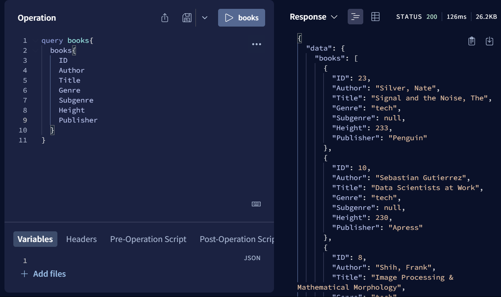

# Gilhari Based GraphQL Resolver with Apollo Server
This project demonstrates a simple example implementations of a GraphQL resolver using a Gilhari microservice with Apollo Server. The project has one class - `Book` - as defined in `schema.js`. Users can run the `books` query while the project is running in Apollo's interactive playground at http://localhost:4000. 

## Gilhari Setup
In a new terminal, `cd` to `Gilhari/README.md` and follow the instructions there to configure and run the Gilhari microservice.

## Running Apollo Server 
Make sure nodejs and npm are installed. You can run the commands `node -v` and `npm -v` to confirm.
### Install dependencies
Run the command `npm i` or `npm install` to install all dependencies from `package-lock.json`
### Populating database (first time setup)
If this is the first time running this project after setting up Gilhari, or after creating a new database, run the command `node populateDatabase.js` to run the script file that populates the database with `Book` objects.
### Running Apollo Server
Run the command `node index.js` or `npm start` to expose the server at http://localhost:4000. You may run queries in the interactive playground provided by opening the link in a browser.
