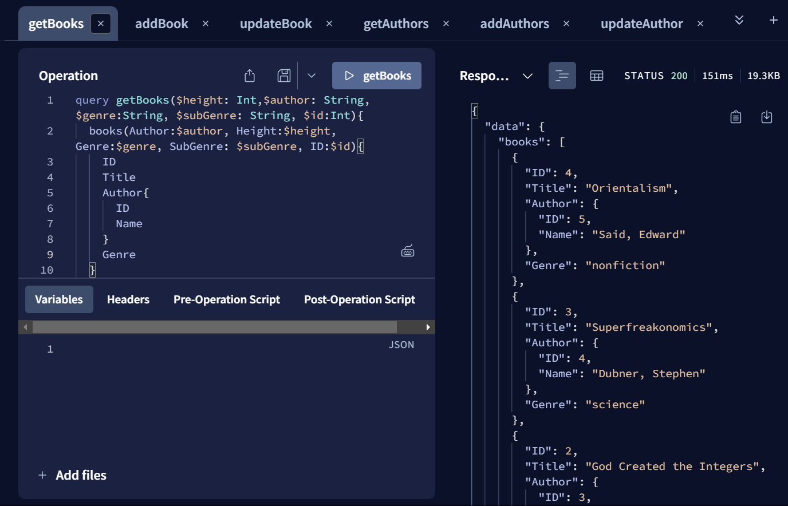

# Gilhari Based GraphQL Resolver with Apollo Server

## About Gilhari
This project uses Gilhari microservice framework to exchange JSON data with relational databases. Gilhari is a product of Software Tree, LLC. GilhariTM is a microservice framework to provide persistence for JSON objects in relational databases. Available in a Docker image, it is configurable as per an app-specific object and relational models. Gilhari exposes a REST (REpresentational State Transfer) interface to provide APIs (POST, GET, PUT, DELETE…) for CRUD (Create, Retrieve, Update, and Delete) operations on the app-specific JSON objects. You may get more information about Gilhari and its SDK at https://www.softwaretree.com.
## About the Project
This project demonstrates a simple example implementations of a GraphQL resolver using a Gilhari microservice with Apollo Server. The project has two classes - `Book` and `Author` - as defined in `schema.js`. The project also demonstrates how Gilhari can help solve the N+1 requests problem for GraphQL APIs. Users can run queries and mutations while the project is running in Apollo's interactive playground at http://localhost:4000. 

## Gilhari Setup
In a new terminal, `cd` to `Gilhari/README.md` and follow the instructions there to configure and run the Gilhari microservice.

## Running Apollo Server 
Make sure nodejs and npm are installed. You can run the commands `node -v` and `npm -v` to confirm.
### Install dependencies
Run the command `npm i` or `npm install` to install all dependencies from `package-lock.json`
### Populating database (first time setup)
If this is the first time running this project after setting up Gilhari, or after creating a new database, run the command `node populateDatabase.js` to run the script file that populates the database with `Book` and `Author` objects.
### Running Apollo Server
Run the command `node index.js` or `npm start` to expose the server at http://localhost:4000. You may run queries in the interactive playground provided by opening the link in a browser.

## Example Queries & Mutations for CRUD Operations
### Read

### Create

### Update

### Delete

## The N+1 Problem and Solution
The "N+1 problem" is a common issue in software development, particularly in the context of database queries within applications. It often arises in object-relational mapping (ORM) frameworks when loading related entities from a database. To illustrate the issue, consider the following psuedocode example that loads a list of users and their respective posts:\
`userlist = SELECT * FROM users;`\
`FOR user IN userlist {`\
    `user.posts = SELECT * FROM posts WHERE user_id = ?;`\
`}`
The first query runs once. However, if there are N users, the second query to get all posts runs N times - giving rise to the N+1 problem.

The same issue occurs when the data source is a REST API - firstly, a GET request to get all users at `BASE_URL/users`, then GET requests for each id at `BASE_URL/users/user_id/posts`.

 This approach can lead to performance issues due to the large number of database round-trips, especially if N is large.

Gilhari solves this issue in the way that it makes database queries - consider the following GraphQL query to get books and their ID, Title and Author details:

This would be a textbook case of the N+1 problem - 1 request for N books, and N requests for each book's Author details. However, looking at the Gilhari logs, we see that only 2 queries are passed:

This effectively makes systems using Gilhari more performant by reducing the number of requests made for complex queries.

