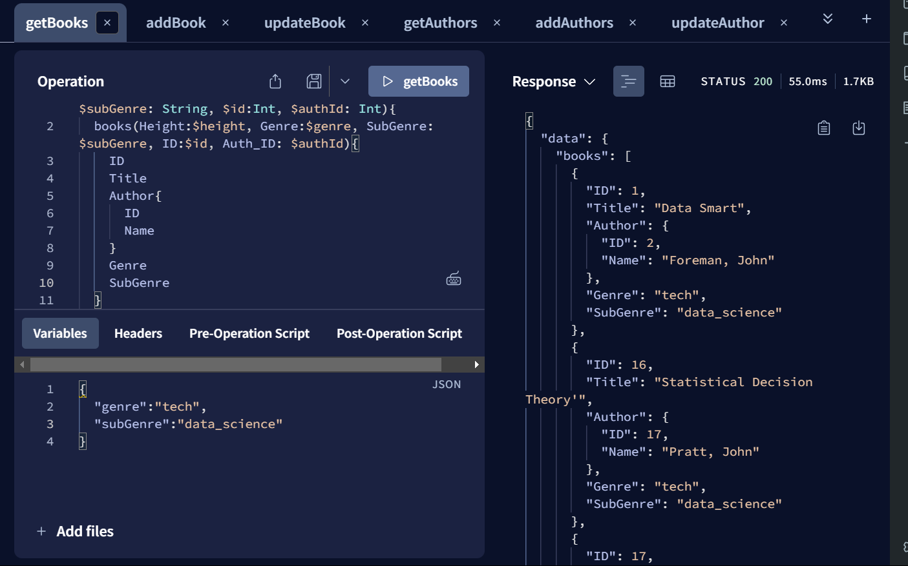
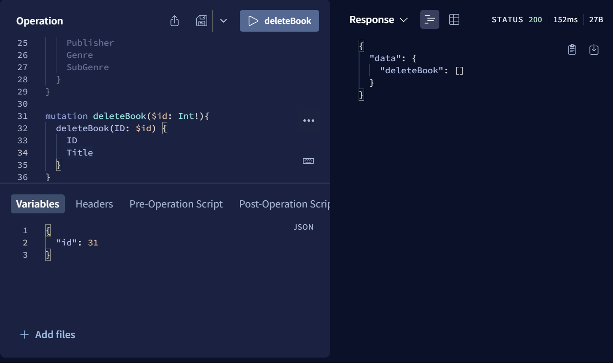
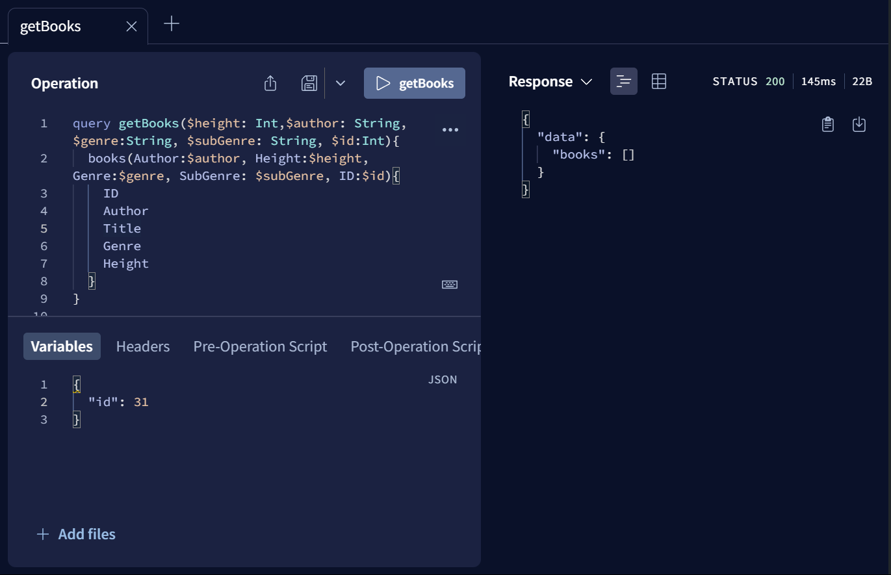

# Apollo Server with Gilhari based Resolvers

## Steps to run
Run the command `npm start` or `npm run start-server` to expose the server at http://localhost:4000. You may run queries in the interactive playground provided by opening the link in a browser.

## Example Queries & Mutations for CRUD Operations
### Read

### Create

### Update

### Delete

